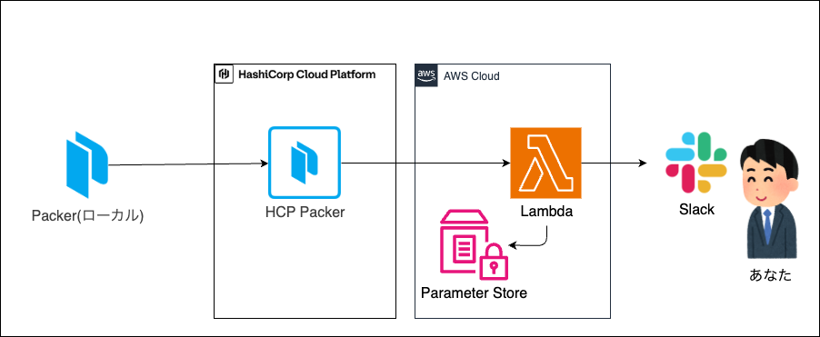
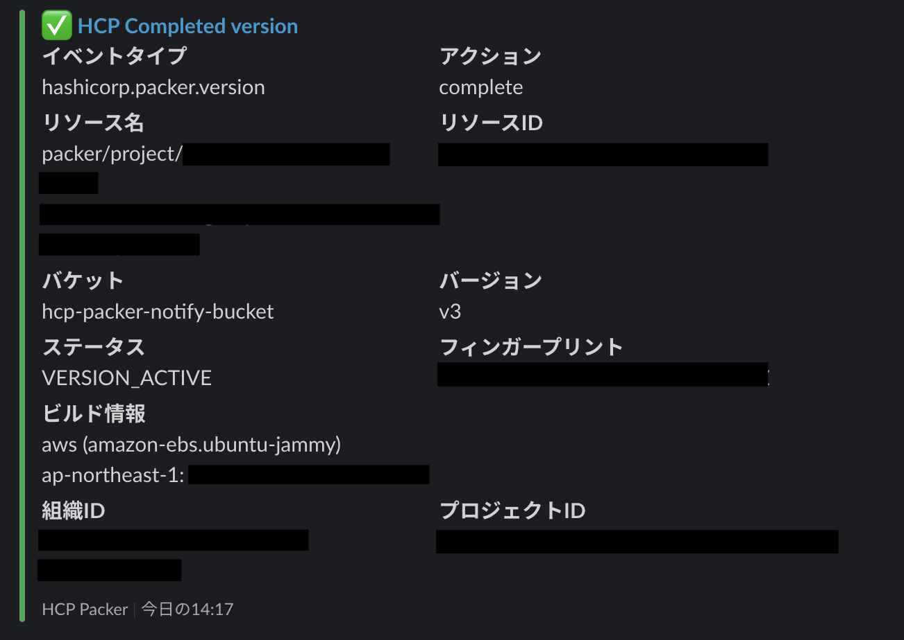

# hcp-packer-notify

HCP Webhook Service を使って、  
HCP Packer のイベントをSlackに通知するサンプルアプリです。

* [HCP Webhook Service](https://developer.hashicorp.com/hcp/api-docs/webhook)

Webhookから配信されるペイロードのサンプルや、イベントの種類は以下をご参照ください。

* [Create and manage webhooks](https://developer.hashicorp.com/hcp/docs/hcp/admin/projects/webhooks)
* [Webhook events](https://developer.hashicorp.com/hcp/docs/packer/reference/webhook)

## アーキテクチャ


## 通知イメージ


## 事前準備

* AWSアカウント 作成
* HCPアカウント/プロジェクト 作成
* Slack Webhook URL 取得
* Packer / Terraform 実行環境

## 作成

### 1.サービスプリンシパル作成

以下ドキュメントの手順を参考に、Packer実行時に利用するサービスプリンシパルを作成してください。  
Roleは `Contributor` を指定します。

* [service-principal](https://developer.hashicorp.com/hcp/docs/hcp/iam/service-principal)

### 2.Terraform実行

以下コマンドで `terraform.tfvars` を作成します。  
値は実際利用するものに修正してください。

```
cat <<EOF >> ./terraform/terraform.tfvars
slack_webhook_url = "https://hooks.slack.com/services/XXX/XXX/XXX" # 取得したSlack Webhook URL
slack_channel     = "#channel-name"                                # 通知先Slack Channel
app_name          = "hcp-packer-notify"                            # アプリ名
aws_region        = "ap-northeast-1"                               # 作成リージョン
project_id        = "XXXX-XXXX-XXXX-XXXX-XXXX"                     # HCP プロジェクトID
EOF
```

`terraform apply` でリソースを作成します。

```
cd ./terraform;
terraform init;
terraform apply;
```

### 3.Packer実行

Terraformリソースの作成が完了したら、Packerでイメージを作成します。  

まず以下コマンドで `variables.auto.pkrvars.hcl` を作成します。  
値は実際利用するものに修正してください。

```
cd ../;
cat <<EOF >> ./packer/variables.auto.pkrvars.hcl
region        = "ap-northeast-1"           # 作成リージョン
instance_type = "t3.micro"                 # インスタンスタイプ
bucket_name   = "hcp-packer-notify-bucket" # HCP Packer バケット名
version       = "1.0.0"                    # AMI名に付与するバージョン
EOF
```

次に取得したHCPのサービスプリンシパルを環境変数に追加します。  
値は実際利用するものに修正してください。

```
export HCP_CLIENT_ID="XXXXXXXXXXXXX";
export HCP_CLIENT_SECRET="XXXXXXXXXXXXX";
```

packerのビルドを実行します。  
HCP Packer側でイベントが発生する度、Slackに通知がきます。

```
cd ./packer;
packer build .;
```

## 削除

以下で Terraformリソース を削除します。  
なお作成されたイメージ(AMI/スナップショット)は削除されないため、必要に応じて削除を実施してください。

```
terraform destroy;
```
